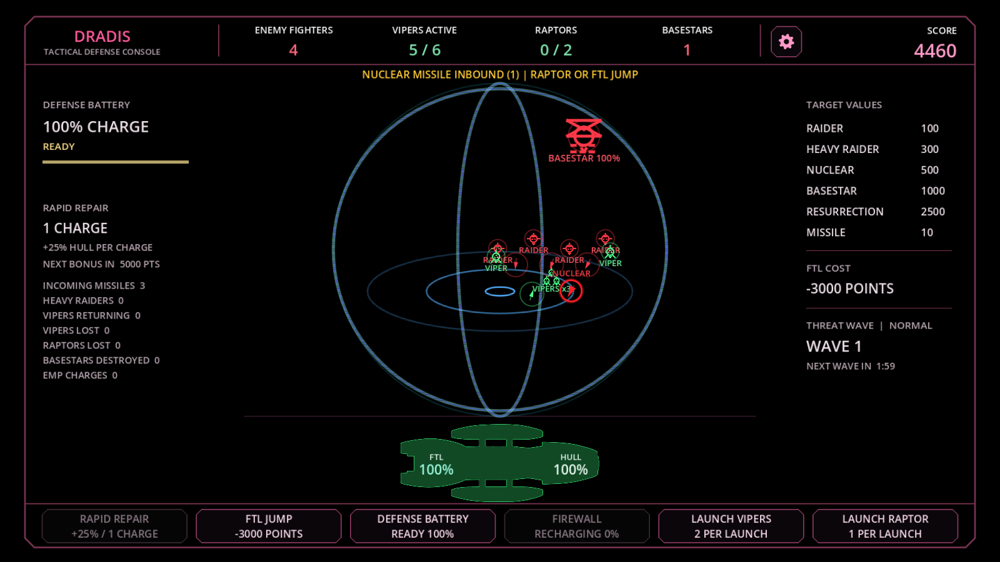

# DRADIS Battle Console

A tactical defense game for Windows (x64 and arm64) and Mac (Apple M-series and Intel), inspired by the DRADIS radar console from the 2003 Battlestar Galactica series. Cylon Raiders, Heavy Raiders, Basestars, nuclear missiles and Resurrection Ships close in on the scope in rising waves. Defend your battlestar with Vipers, Raptors, ship missiles, the defense battery and the firewall, using only the mouse or a touch screen.

> **Unofficial fan project.** DRADIS Battle Console is a free, non-commercial fan tribute. It is not affiliated with, authorized or endorsed by Universal City Studios LLC, NBCUniversal, Syfy or any owner of the Battlestar Galactica franchise. All names belong to their owners and are used only to identify the series. No footage, images or audio from the series are included. See [NOTICE.md](NOTICE.md) for the full disclaimer and the photosensitivity warning.

## Features

- An animated 3D DRADIS dome with a 2-second sweep pulse and original synthesized audio.
- Friendly (green) and hostile (red) contacts with authentic-style icons. Unknown contacts are identified as they approach.
- Threat waves every 2 minutes, with more Basestars, faster launches and more Heavy Raiders.
- Viper squadrons that split up to engage and rejoin when the area is clear.
- Raptors for nuclear missiles and Basestars, ship missiles that change target, a defense battery for close missiles, and a firewall and EMP against Heavy Raider hacking.
- Rapid Repair, FTL jumps, Easy, Normal and Hard difficulty, and optional auto modes.
- High scores with per-battle stats (hover or tap an entry) and the best score shown during play; settings saved on the computer, with a session log for troubleshooting.

## Supported computers

| Computer | Download |
|---|---|
| Windows PC with an Intel or AMD processor (x64) | `DRADIS_Battle_Console_<version>_Windows_x64.exe` |
| Windows PC with an ARM processor (arm64), such as a Surface Pro or Snapdragon laptop | `DRADIS_Battle_Console_<version>_Windows_arm64.exe` |
| Mac with an Apple M-series chip (M1 or later) or an Intel processor | `DRADIS_Battle_Console_<version>_Mac.dmg` (one Universal app for both) |

## Download and play

Ready-to-play copies are on the [Releases](https://github.com/S8619G/DRADIS-Battle-Console/releases) page when available:

- **Windows:** download the `.exe` for your PC (x64 for Intel and AMD PCs, arm64 for Windows on ARM PCs) and double-click it. The game is not code-signed, so Windows may show "Windows protected your PC". Click **More info**, then **Run anyway**.
- **Mac:** the same `.dmg` works on Macs with Apple M-series chips and on Intel Macs. Open it and drag the app to Applications. The app is not notarized. The first time, open **System Settings > Privacy & Security** and click **Open Anyway** next to DRADIS Battle Console.

No installation or extra software is needed.

**Photosensitivity warning:** the game contains flashing lights, full-screen flashes and pulsing images. See [NOTICE.md](NOTICE.md) before playing.

## Controls

The console buttons along the bottom:

| Button | What it does |
|---|---|
| RAPID REPAIR | Uses a repair charge: +25% hull over 5 seconds. |
| FTL JUMP | Jumps away and clears the scope, at a cost of 3,000 points. Offline while a Heavy Raider is draining the hull. |
| DEFENSE BATTERY | Flak against missiles close to the ship. |
| FIREWALL / EMP | Blocks a Heavy Raider hack. When the firewall runs out, the button splits to offer an EMP if a charge is ready. |
| LAUNCH VIPERS | Launches Vipers to intercept Raiders and missiles. |
| LAUNCH RAPTOR | Launches a Raptor that fires at nuclear missiles and Basestars. |

The gear icon at the top right opens Settings (volumes, difficulty and auto modes). The full rules are in the [User Guide](docs/USER_GUIDE.md).

## Run from source

1. Install [Godot 4.7](https://godotengine.org/download) (standard version; the .NET version is not needed). Godot runs on Windows x64 and arm64 and on Apple M-series and Intel Macs.
2. Download this repository (**Code > Download ZIP**) and extract it, or clone it.
3. In the Godot Project Manager, choose **Import** and select `project.godot`.
4. Press F5 (or click **Run Project**).

Most game values can be tuned in the Godot Inspector: select a node such as **DradisConsole** or **Contacts** in the scene tree. The [User Guide](docs/USER_GUIDE.md) lists the settings, and the **Export** section explains how to build the Windows and Mac versions.

## Project layout

| Path | Contents |
|---|---|
| `project.godot`, `export_presets.cfg` | Godot project settings and the Windows and macOS export presets |
| `scenes/` | The main console scene and the tuning panel |
| `scripts/` | Game logic (GDScript) |
| `assets/` | Original artwork and audio |
| `docs/` | User Guide, release steps, screenshots and development history |
| `CHANGELOG.md` | Changes in each version |

## Built with

- [Godot Engine](https://godotengine.org) 4.7, GDScript and the GL Compatibility renderer.

## License and disclaimer

The original code, artwork and audio created for this project are released under the [MIT License](LICENSE), provided "as is" without warranty of any kind. The license does not cover Battlestar Galactica names, trademarks or other material owned by others, and it does not grant permission to sell or monetize anything that uses them. See [NOTICE.md](NOTICE.md).

Battlestar Galactica and related names are trademarks or copyrighted material of their respective owners. This is a fan project made for enjoyment only.
